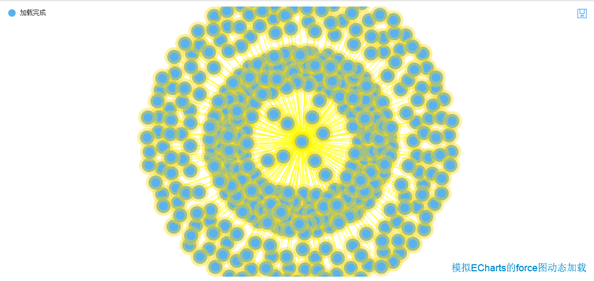

模拟ECharts中force图的动态加载
===================================
使用[ECharts](https://github.com/ecomfe/echarts)
----------------------------------- 
### v0.1.0  
### author by So Aanyip

由于ECharts中force图在node数目变化的时候会触发重新布局，如果采取真实的动态加载会触发很多次的布局，得不偿失。而如果在有需要做出动态加载的效果的情况下，切入点就是先让数据全部加载为一个单独的category，这个category的节点颜色为rgb(255,255,255,0)透明色，link的颜色也如此。当全部加载完的时候再逐步的把点线的颜色设置出来，模拟出动态添加node跟link的效果。当然这种方法只在node跟link的数量偏少的情况下比较合适。仅供参考。

 example 

	
